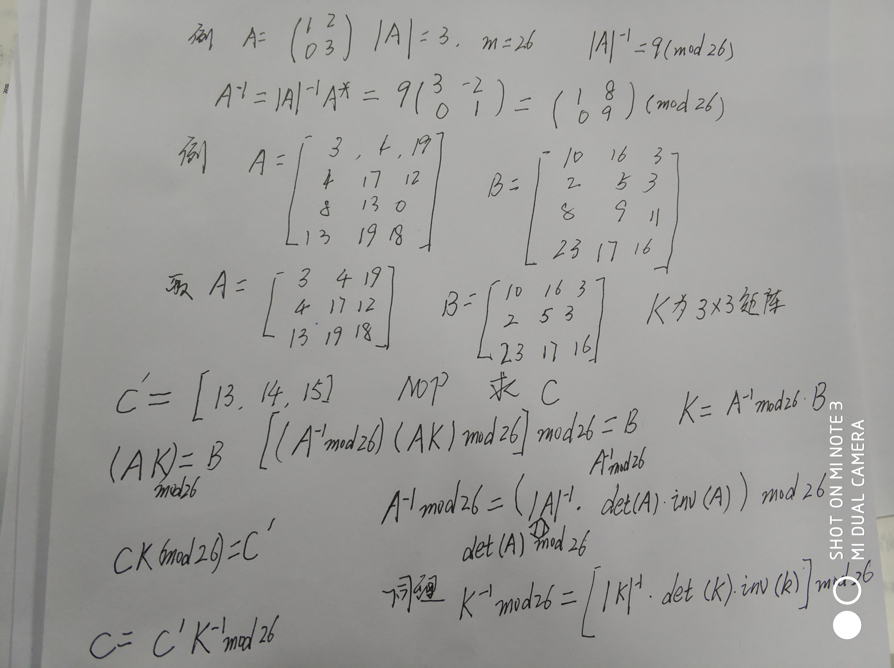
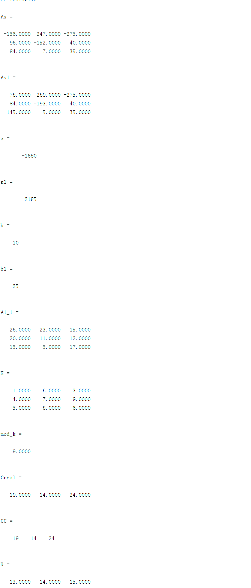

# 最主要是关于模m矩阵的实际解法问题


# 伴随矩阵求模m的逆矩阵




# matalab试验求解，由于计算量巨大，我也不擅长矩阵计算 这里直接给出代码和结果
```
% 所有问题的根源在于mod26，因此在取逆时要采用模m逆矩阵的求法
% 用伴随矩阵求 A-1 = |A|-1 * A*（mod m），
% 其中|A|-1 为|A|模m的逆
A = [ 3 4 19;
    4 17 12;
    8 13 0];

A1 = [ 3 4 19;
    4 17 12;
    13 19 18];

B = [10 16 3 ;
    2 5 3;
    8 9 11
    ];

B1 = [10 16 3 ;
    2 5 3;
    23 17 6
    ];
a = det(A);
a1 = det(A1);
As =det(A)*inv(A);
As1= det(A1)*inv(A1);
As
As1
a
a1
b =  mod(a,26)
b1 =  mod(a1,26)
A1_1 = mod(25*As1,26);
A1_1

K = mod(A1_1*B1,26)
mod_k = mod(det(K),26);
mod_k
K_1 =mod(3*det(K)*inv(K),26);


%下面是验证部分 
C = [13,14,15];
Creal = mod(C*K_1,26);
Creal
KK = inv(K);
CC = [19 14 24]

R =mod(CC*K,26);
R

```



