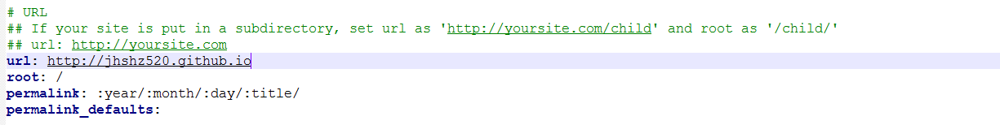

# 本地引用
## 下载插件
npm install hexo-asset-image --save
## 更改配置文件
插入本地图片需要修改主题_config.yml配置文件post_asset_folder项为true


这里我更改的是hexo目录下的配置文件


# 下载的插件js可能存在问题

用下面的代码替换 hexo-asset-image目录下的js文件
```
'use strict';
var cheerio = require('cheerio');

// http://stackoverflow.com/questions/14480345/how-to-get-the-nth-occurrence-in-a-string
function getPosition(str, m, i) {
  return str.split(m, i).join(m).length;
}

var version = String(hexo.version).split('.');
hexo.extend.filter.register('after_post_render', function(data){
  var config = hexo.config;
  if(config.post_asset_folder){
    	var link = data.permalink;
	if(version.length > 0 && Number(version[0]) == 3)
	   var beginPos = getPosition(link, '/', 1) + 1;
	else
	   var beginPos = getPosition(link, '/', 3) + 1;
	// In hexo 3.1.1, the permalink of "about" page is like ".../about/index.html".
	var endPos = link.lastIndexOf('/') + 1;
    link = link.substring(beginPos, endPos);

    var toprocess = ['excerpt', 'more', 'content'];
    for(var i = 0; i < toprocess.length; i++){
      var key = toprocess[i];
 
      var $ = cheerio.load(data[key], {
        ignoreWhitespace: false,
        xmlMode: false,
        lowerCaseTags: false,
        decodeEntities: false
      });

      $('img').each(function(){
		if ($(this).attr('src')){
			// For windows style path, we replace '\' to '/'.
			var src = $(this).attr('src').replace('\\', '/');
			if(!/http[s]*.*|\/\/.*/.test(src) &&
			   !/^\s*\//.test(src)) {
			  // For "about" page, the first part of "src" can't be removed.
			  // In addition, to support multi-level local directory.
			  var linkArray = link.split('/').filter(function(elem){
				return elem != '';
			  });
			  var srcArray = src.split('/').filter(function(elem){
				return elem != '' && elem != '.';
			  });
			  if(srcArray.length > 1)
				srcArray.shift();
			  src = srcArray.join('/');
			  $(this).attr('src', config.root + link + src);
			  console.info&&console.info("update link as:-->"+config.root + link + src);
			}
		}else{
			console.info&&console.info("no src attr, skipped...");
			console.info&&console.info($(this));
		}
      });
      data[key] = $.html();
    }
  }
});

```

# 插入音乐
比如网易云音乐，找到喜欢的歌曲，点击分享按钮，把里面的代码复制下来，直接粘贴到博文中即可
```
<iframe frameborder="no" border="0" marginwidth="0" marginheight="0" width=330 height=86 
	src="http://music.163.com/outchain/player?type=2&id=25706282&auto=0&height=66">
</iframe>

```

### 音乐实验
<iframe frameborder="no" border="0" marginwidth="0" marginheight="0" width=1000 height=1024 
	src="https://music.163.com/artist?id=2111&_hash=songlist-63612">
</iframe>

# 插入视频
```
<iframe 
	height=1000 width=1020 
	src="http://player.youku.com/embed/XNjcyMDU4Njg0" 
	//http://music.163.com/song?id=63612&userid=357443816
	frameborder=0 allowfullscreen>
</iframe>

```

### 插入视频测试

<iframe 
	height=498 width=510 
	src="https://www.bilibili.com/video/av3905462?from=search&seid=10973106338036978982" 
	frameborder=0 allowfullscreen>
</iframe>

